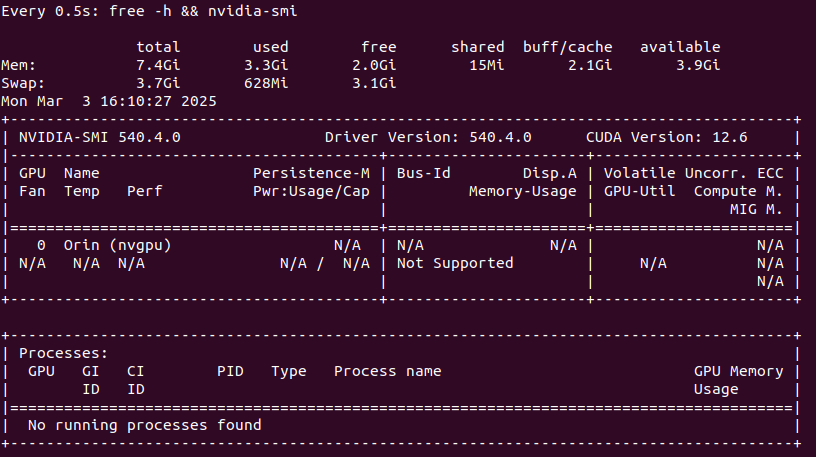

> Issue 1 [Unresolved] - 3/3/25

Problem: 
(venv) machvision@machvision-desktop:~/Documents/senior-design/src/ml/object_detection/run$ python ml_embeddedprod_jetson.py 
cuda:0
Loading YOLOv9 model...
Loading classification model...
Segmentation fault (core dumped)

Debug: 
raw state without applications running

